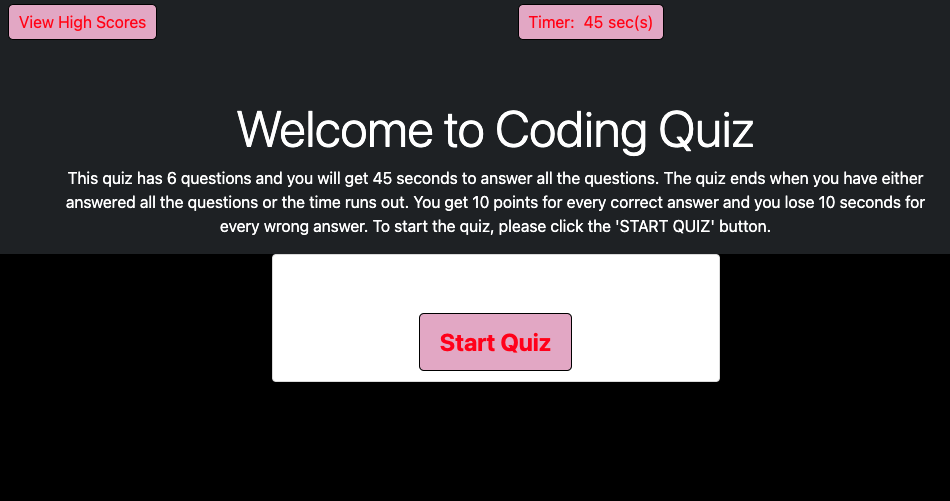
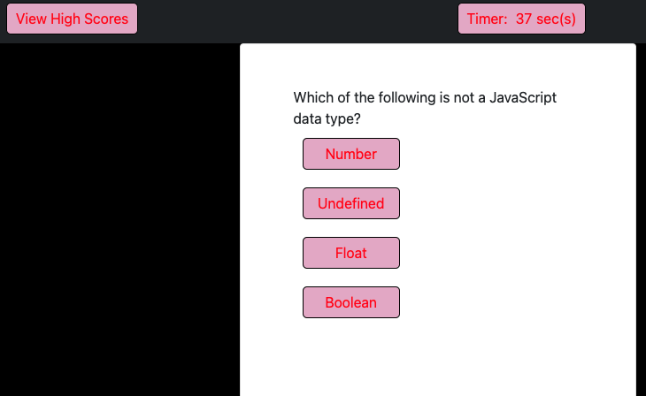
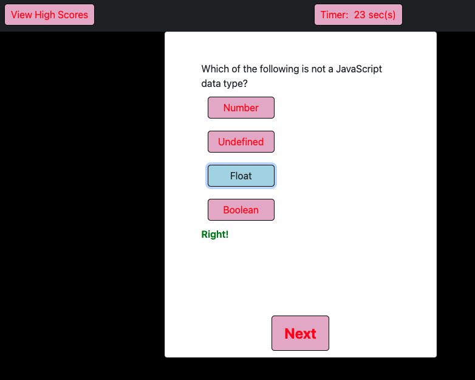
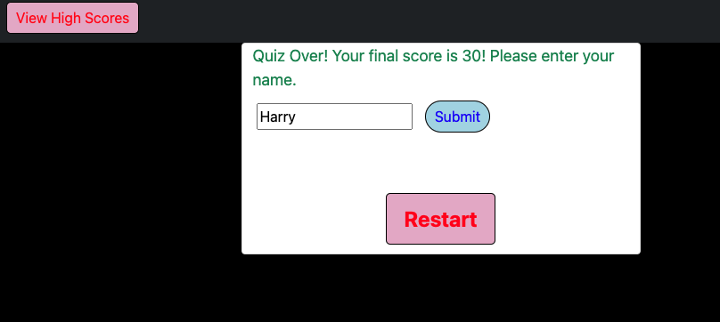
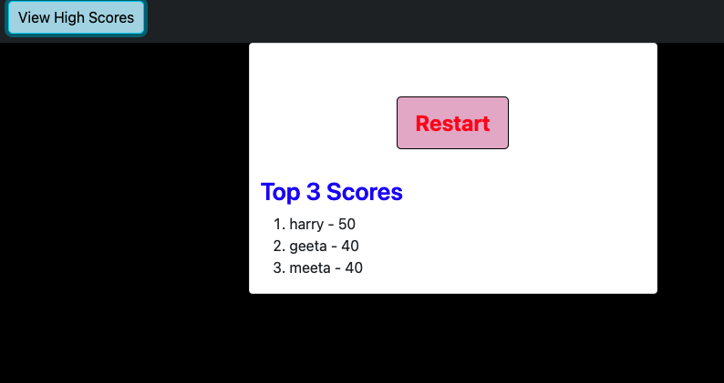

# coding-quiz

 ## [Coding Quiz](https://harry-100.github.io/coding-quiz/)

 ## [GitHub Url](https://github.com/harry-100/coding-quiz)

## This is a timed coding quiz. Following are the general rules for playing.

* There are 6 questions and you get 45 seconds to answer them.

* Each correct answer gets you 10 points.

* Each wrong answer results in 10 seconds being deducted from the time available.

* The quiz is over when all the questions have been answered or you run out of time.

* Final score is displayed at the end of the quiz.

* View High Scores button will display top 3 scores.

## ScreenShots

